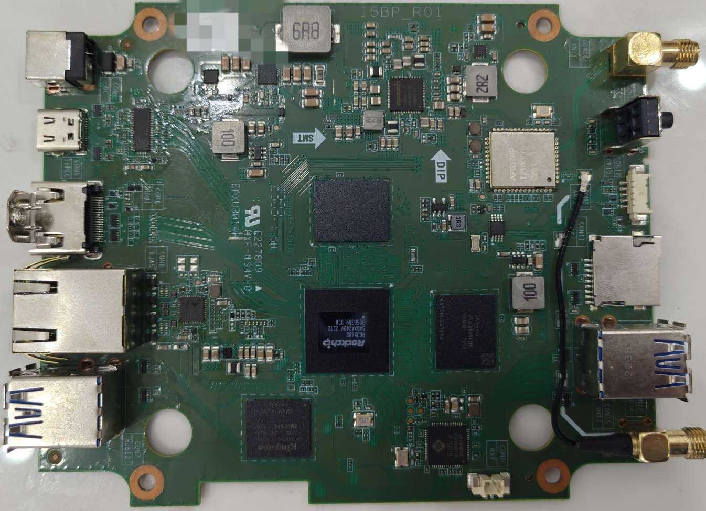
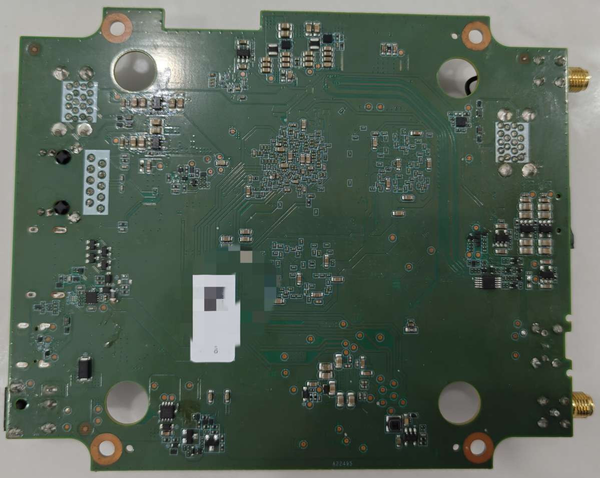
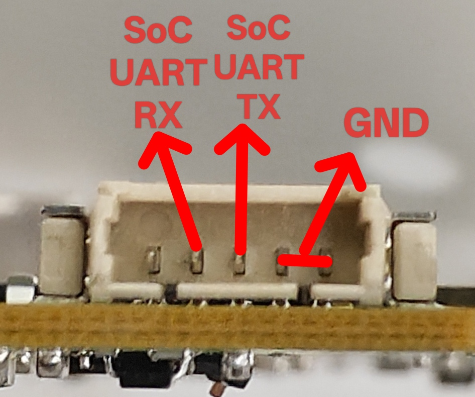
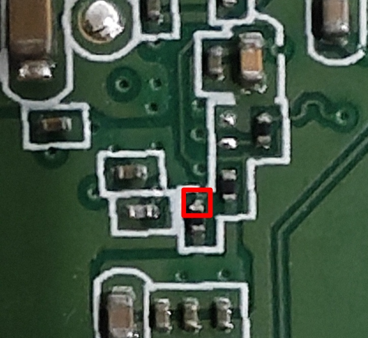

# 固件

[Armbian](https://github.com/retro98boy/armbian-build)

[Batocera](https://github.com/retro98boy/batocera.linux)

Android 14

## 固件安装

对于Armbian/Batocera，将镜像通过MaskROM模式刷入eMMC即可。可在[Releases界面](https://github.com/retro98boy/amlogic-devices/releases/tag/elo-backpack5-rk3588s)找到要用的Loader

对于Android 14，用瑞芯微开发工具Windows版本“升级固件”界面下的“固件”功能选中Android 14固件，然后将板子进入MaskROM或者Loader模式，最后点击“升级即可”

## Android 14使用

### Android 14安装DTBO

将要应用的dtbo文件上传到Android 14系统的`/vendor/custom/boot/dtb/rockchip/rk3588s-khadas-edge2.dtb.overlays`目录下，再修改`/vendor/custom/boot/dtb/rockchip/rk3588s-khadas-edge2.dtb.overlay.env`来声明要使能的dtbo，例如要使能a.dtbo和a.dtbo，其内容应该为`fdt_overlays=a b`

EVT和DVT存在细微差异，Android 14的固件针对DVT开发，只有安装`rk3588s-elo-backpack5-a14-evt.dtbo`才能适配EVT，让以太网等工作

安装`rk3588s-elo-backpack5-a14-disable-uart-console.dtbo`能禁用Android的串口输出，从而消除下拉框提示的性能损失警告

### Android 14升级

由于Android 14不采用VAB分区，所以只能采用传统的Recovery升级办法

执行`adb reboot recovery`命令进入Recovery界面，此时可以选择从microSD卡/U盘应用更新，或者从ADB应用更新

推荐选择从ADB应用更新，然后用A2C线连接设备和PC，在PC上执行`adb sideload path-to-ota-file`并等待更新完成即可

# 硬件

Elo Backpack5 Value版，相对于[原版](https://www.elotouch.com/accessories-backpack-5-android-computer.html)，SoC从QCS6490换成了RK3588S。从某二手平台购买的板子存在两个版本：EVT（R01字样）和DVT（R02字样）。主要规格：

- 4G LPDDR5 + 64G eMMC

- 5525规格DC电源输入（经测试19V可以开机）

- HDMITX x1（EVT稳定性差于DVT）

- GBE x1

- USB 3.2 Gen1 Type-A x4

- 全功能Type-C（经测试DP输出可用，PD受电未测试成功。DVT和EVT使用的cc logic芯片不一致）

- microSD卡槽 x1（由于供电需要软件打开，所以在microSD卡刻录bootloader并不会被BOOTROM检测到并启动）

- AP6276P WLAN/BT





调试串口：



eMMC短接点（位于eMMC颗粒的PCB背面，将红框中的一侧短接到GND）：



# 开发

## 制作Loader

```bash
git clone https://github.com/rockchip-linux/rkbin
cd rkbin
./tools/boot_merger RKBOOT/RK3588MINIALL.ini .

# 如果要修改DDR驱动/TPL串口波特率/TPL串口
export ROCKCHIP_TPL=$(readlink -f bin/rk35/rk3588_ddr_lp4_2112MHz_lp5_2400MHz_v*.bin | head -1)
sed -i 's/^uart baudrate=.*$/uart baudrate=115200/' tools/ddrbin_param.txt
sed -i 's/^uart iomux=.*$/uart iomux=0/' tools/ddrbin_param.txt
python3 ./tools/ddrbin_tool.py rk3588 tools/ddrbin_param.txt "$ROCKCHIP_TPL"
./tools/boot_merger RKBOOT/RK3588MINIALL.ini .
```

# 相关链接

[SBC-RK3588-AMR Jaguar](https://docs.u-boot.org/en/stable/board/theobroma-systems/jaguar_rk3588.html)
