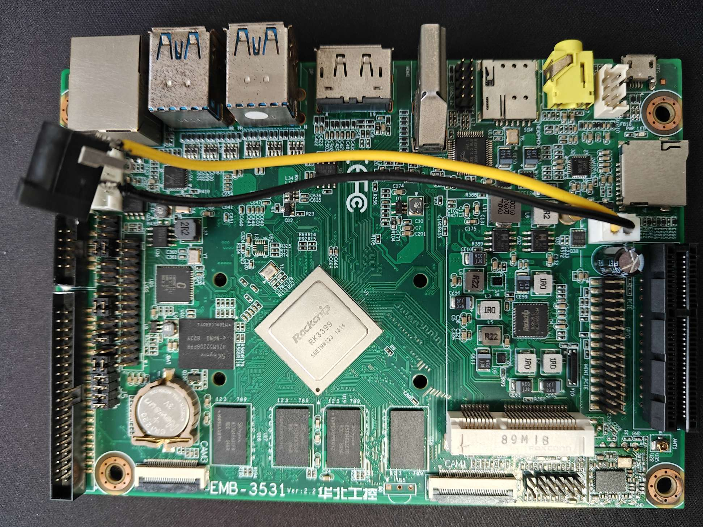
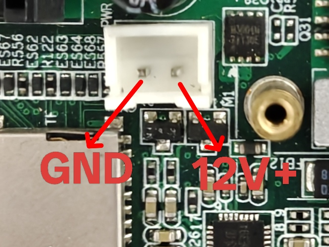
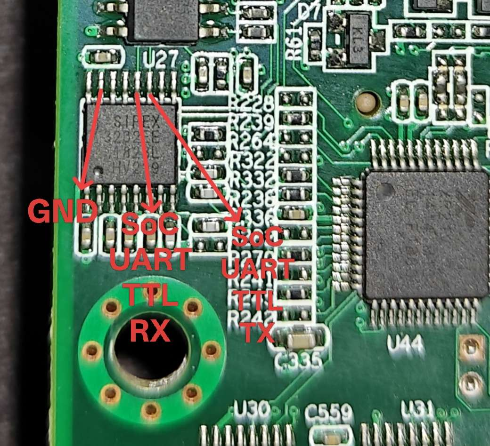
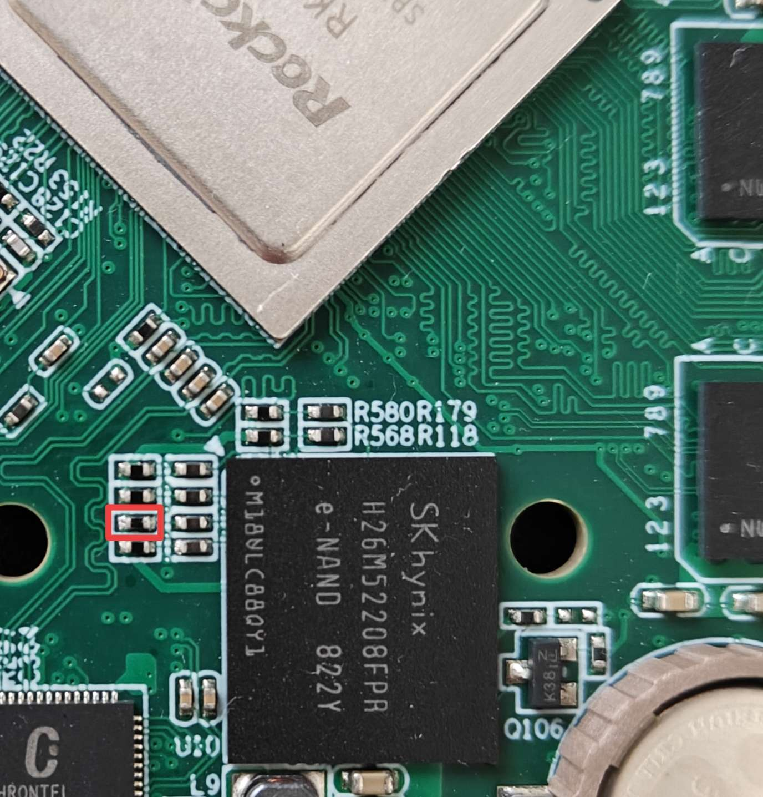
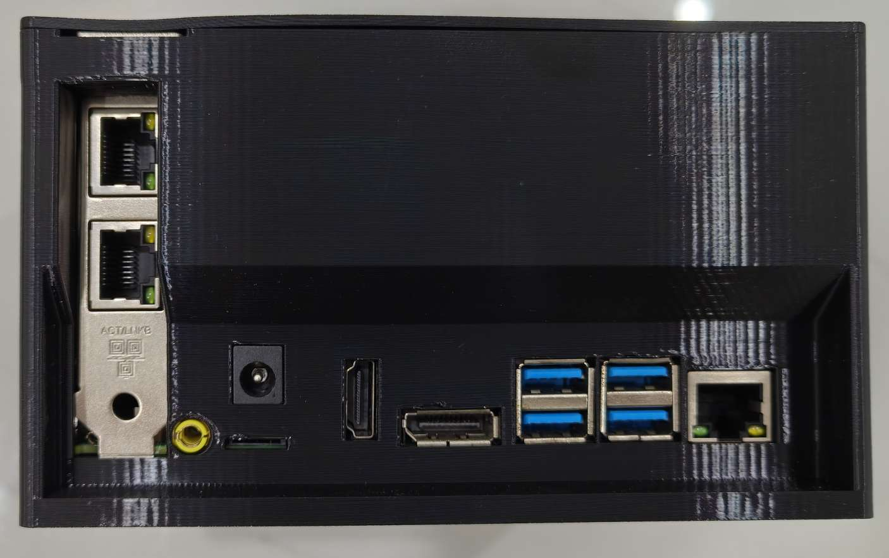

# 固件

[Armbian](https://armbian.cn/boards/norco-emb-3531)

[OpenWrt](https://github.com/retro98boy/openwrt)

## 固件安装

只要通过RKDevTool将固件.img刷入eMMC即可。在[此处](https://github.com/retro98boy/tiannuo-tn3399-v3-linux/tree/main/tools)下载loader。MicroUSB用于线刷

该设备无法从microSD卡加载U-Boot，所以不能完全从microSD卡启动系统。如果一定要把系统安装在microSD卡上，还需要将U-Boot单独刻录到eMMC上

## 固件使用

### 音频

3.5mm耳机/麦克风，喇叭/外接麦克风工作都正常

安装桌面后可以自由切换音频输出设备和音频录制设备

未安装桌面时，可以通过alsaucm命令来设置输出/输入设备，命令见[此处](https://github.com/armbian/build/blob/main/config/boards/norco-emb-3531.csc)

# 硬件

华北工控EMB-3531，RK3399主控，2GB DDR3（可选4G）

供电接口为JST XH 2.54：

该设备采用RS232电平调试串口，也可以飞线接出TTL电平的串口使用：

短接下图中电阻两端再上电可以让设备进入Maskrom模式：

该设备最大的亮点是带x4带宽的PCIe标准插槽。非常适合插入一张双2.5G网卡作为路由器。相对于USB网卡，PCIe网卡显然更稳定

