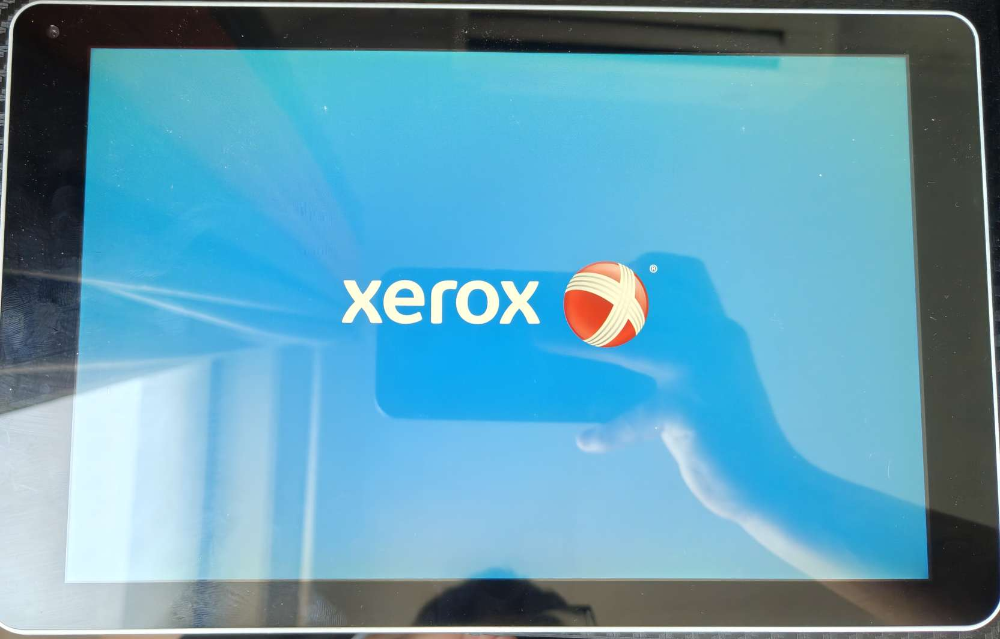
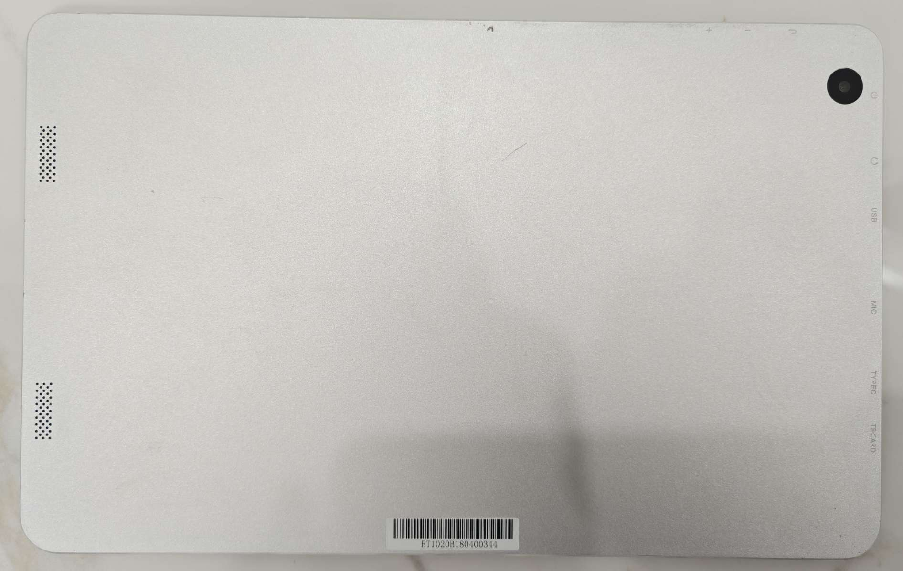
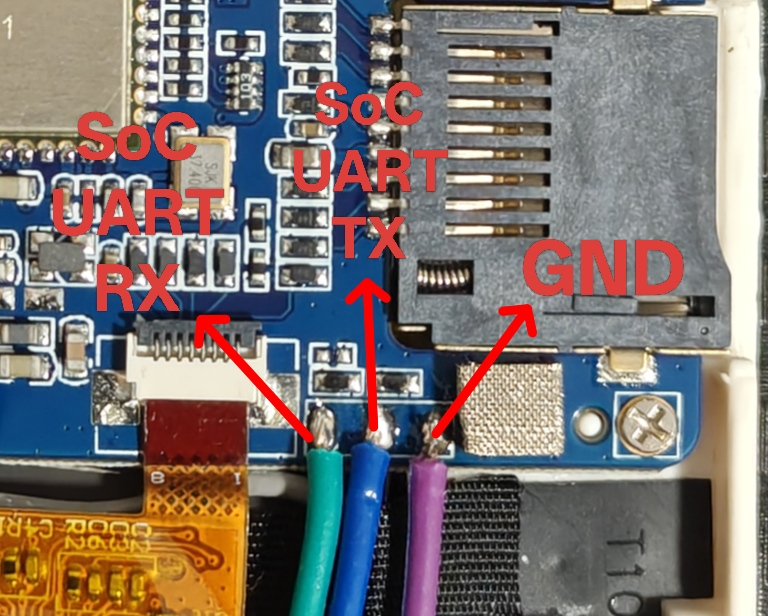
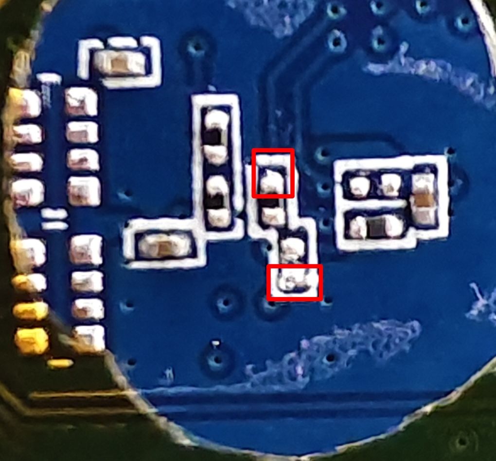
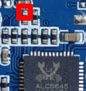
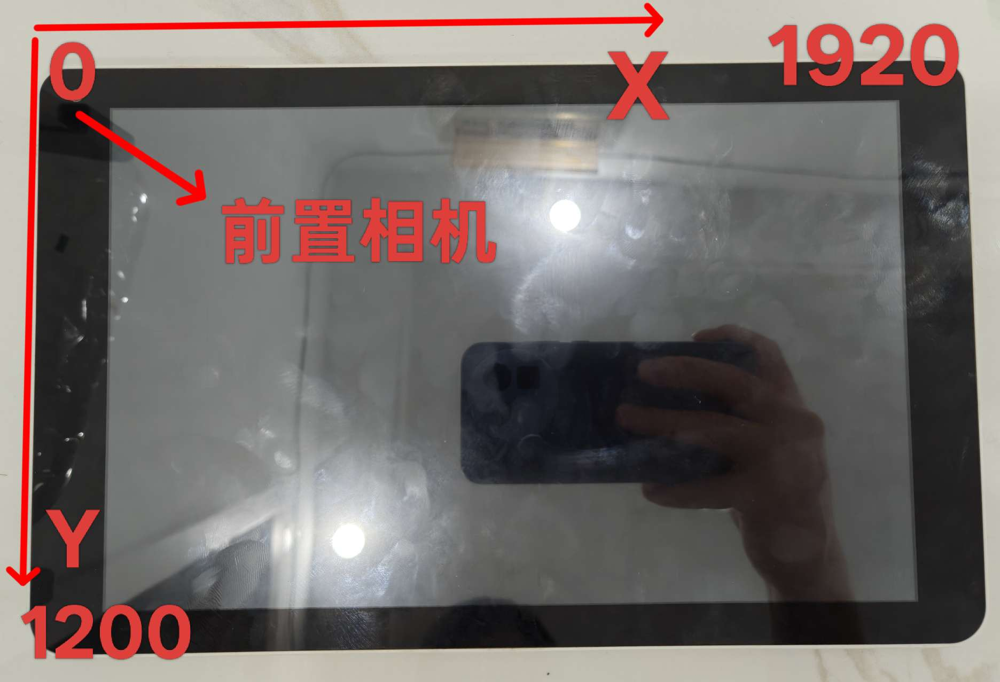
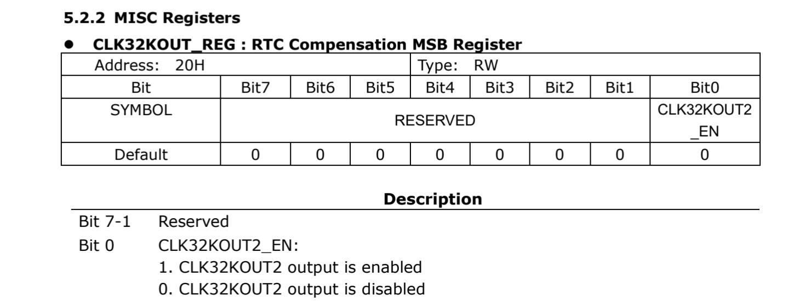
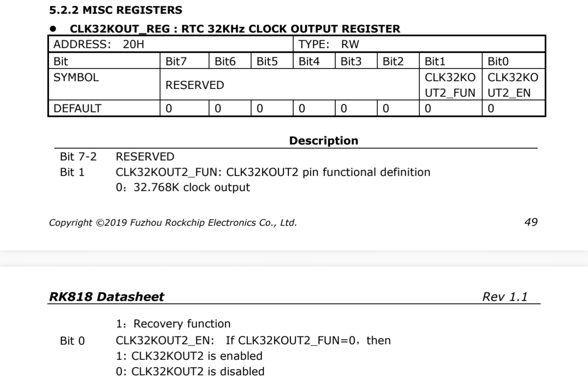

# 固件

[Armbian](https://github.com/retro98boy/armbian-build)

[Batocera](https://github.com/retro98boy/batocera.linux)

## 固件安装

方法一：

拆开平板，短接eMMC再给平板上电就能进入MaskROM模式。然后通过RKDevTool将固件.img刷入eMMC即可。在[此处](https://github.com/retro98boy/tiannuo-tn3399-v3-linux/tree/main/tools)下载loader。平板的Type-C接口用于MaskROM线刷

注意：由于eMMC短接点在PCB的背部，这意味着不仅要拆掉平板后盖，还要取下PCB，耗时且风险大

方法二：

某二手平台卖的该平板是自带Magisk的，只要安装Magisk APP就可以管理root权限了。然后在平板上安装一个终端模拟器，输入su并授权后，在root shell下通过dd命令将eMMC user area的前4MiB擦除，再reboot。这样eMMC上的U-Boot就被摧毁了。这时有两个选择：

- 将系统镜像刻录到micro SD卡，插入平板再上电，SoC会从micro SD卡加载U-Boot并启动系统

- 直接把平板通过USB A2C线连接到电脑，平板自动进入MaskROM模式，线刷即可

## 外设工作情况

| Component             | Status                         |
|-----------------------|--------------------------------|
| DSI Panel             | Working                        |
| Touchscreen           | Working                        |
| Backlight             | Working                        |
| WiFi                  | Working                        |
| BT                    | Working                        |
| Micro USB             | Working (forcing host)         |
| Type-C PD?            |                                |
| Type-C USB Data?      |                                |
| Type-C DP alt mode?   |                                |
| eMMC                  | Working                        |
| micro SD              | Working                        |
| Headphones            | Not Working                    |
| Internal Speakers     | Working                        |
| Power Button          | Working                        |
| Volume/Back Button    | Working                        |
| GPIO Led              | Working                        |
| RK818 RTC             | Not Test                       |
| AK8963 Hall Sensor    | Working (disabled by default)  |
| MPU6500 IMU           | Working (disabled by default)  |
| OV8858 camera         | Not Working                    |
| GC2145 camera         | Not Working                    |

## 音频设置

用户无需自己设置ALSA控件。如果使用场景为GUI例如GNOME，只需要在设置App里面选择输出设备。如果使用场景为CLI，可以使用alsaucm命令设置输出设备，命令参考[这里](https://github.com/retro98boy/armbian-build/blob/main/config/boards/xerox-et1020.csc)

# 硬件

施乐打印机控制面板，原安卓系统里面显示型号为Xerox ET1020，存储配置为2G DDR3 + 16G eMMC





调试串口：



eMMC短接点（短接两个红框即可）：



## 供电

平板可使用Type-C接口供电，保险电压为5V，电源最大电流最好4A，否则启动Linux图形界面时可能会限流导致重启

推荐使用DC直流电源改装Type-C接口（注意正负不要接反）。因为作者使用QC 3.0手机电源适配器加A2C线给平板供电一晚后主板烧了。原因不明，不知道是SoC过热烧毁，还是手机电源适配器协商出错输出了大电压。所以不带协商功能的DC直流电源最稳妥

# 开发

## 模拟音频

主线内核的ALC5645驱动存在Bug，需要打补丁使能mclk，否则即使驱动加载，amixer配置正确，也不会有声音。补丁在[此](https://github.com/retro98boy/armbian-build/blob/7f2454bd117f12556e526df6998a1c90bf5070f2/patch/kernel/archive/rockchip64-6.18/general-rt5645-add-mclk.patch)。可能还需要[此补丁](https://github.com/retro98boy/armbian-build/blob/7f2454bd117f12556e526df6998a1c90bf5070f2/patch/kernel/archive/rockchip64-6.18/rk3399-add-sclk-i2sout-src-clock.patch)

调试过程中，尝试播放音乐，但是无音频且mclk无波形。并不一定是驱动/dts中对mclk的配置出问题。如果控件没配置成功，mclk也是持续低电平的，可能是SoC这边输出了波形，但是ALC5645持续拉低了？

mclk测量点：



控件配置（一般用户无需关注，系统镜像中存在写好的ALSA UCM配置）：

```
# 公共输出设置
amixer -D hw:xeroxet1020 cset name='Stereo DAC MIXR DAC R1 Switch' on
amixer -D hw:xeroxet1020 cset name='Stereo DAC MIXL DAC L1 Switch' on
amixer -D hw:xeroxet1020 cset name='DAC1 MIXR DAC1 Switch' on
amixer -D hw:xeroxet1020 cset name='DAC1 MIXL DAC1 Switch' on

# 喇叭输出设置
amixer -D hw:xeroxet1020 cset name='Speaker ClassD Playback Volume' 0
amixer -D hw:xeroxet1020 cset name='Speaker Playback Volume' 39
amixer -D hw:xeroxet1020 cset name='SPOL MIX SPKVOL L Switch' on
amixer -D hw:xeroxet1020 cset name='SPOR MIX SPKVOL R Switch' on
amixer -D hw:xeroxet1020 cset name='SPKVOL L Switch' on
amixer -D hw:xeroxet1020 cset name='SPKVOL R Switch' on
amixer -D hw:xeroxet1020 cset name='SPK MIXL DAC L1 Switch' on
amixer -D hw:xeroxet1020 cset name='SPK MIXR DAC R1 Switch' on
amixer -D hw:xeroxet1020 cset name='Speaker Channel Switch' on

# 耳机输出设置
amixer -D hw:xeroxet1020 cset name='Headphone Playback Volume' 39
amixer -D hw:xeroxet1020 cset name='HPO MIX HPVOL Switch' on
amixer -D hw:xeroxet1020 cset name='HPOVOL L Switch' on
amixer -D hw:xeroxet1020 cset name='HPOVOL R Switch' on
amixer -D hw:xeroxet1020 cset name='HPOVOL MIXL DAC1 Switch' on
amixer -D hw:xeroxet1020 cset name='HPOVOL MIXR DAC1 Switch' on
amixer -D hw:xeroxet1020 cset name='Headphone Channel Switch' on
```

ALC5645的控制选项较多，如果自己使用amxier/alsamixer折腾后发现音频路由混乱而无法正常使用，可通过下面的方法恢复：

```
# 配置会被保存到asound.state，删除后重启即可
# 删除前停止自动保存的service
sudo systemctl stop alsa-restore.service && sudo rm /var/lib/alsa/asound.state && sudo reboot
```

## 触摸屏

通过evtest得到触摸屏的坐标系如下：



## WLAN/BT

网友symbol_undefine找到了WLAN/BT不工作的原因并修复了它。原因是RK818的32k时钟不输出，而AP6255依赖它。下面是RK808和RK818数据手册中关于32k时钟的部分





可以看出，RK818需要多设置一个bit才能输出32k时钟，Linux内核中RK818的驱动大部分复用RK808，针对32k时钟部分没有额外处理，直接使用RK808的逻辑，当然无法正确的输出32k时钟。这也是为什么WLAN/BT部分的dts从某个RK808的板子复制过来，RK808板子的WLAN/BT功能正常而RK818板子就不行

具体的修复补丁见[此处](https://github.com/retro98boy/armbian-build/commit/874050945bc0fa3d92db2d5182b72a06cfa337b1#diff-570a5f342f3b7cc311aec079c378f9c068f196195636f29f72ad176abf7b05fb)，截至目前7.0内核，RK818 32k时钟的Bug依然存在
